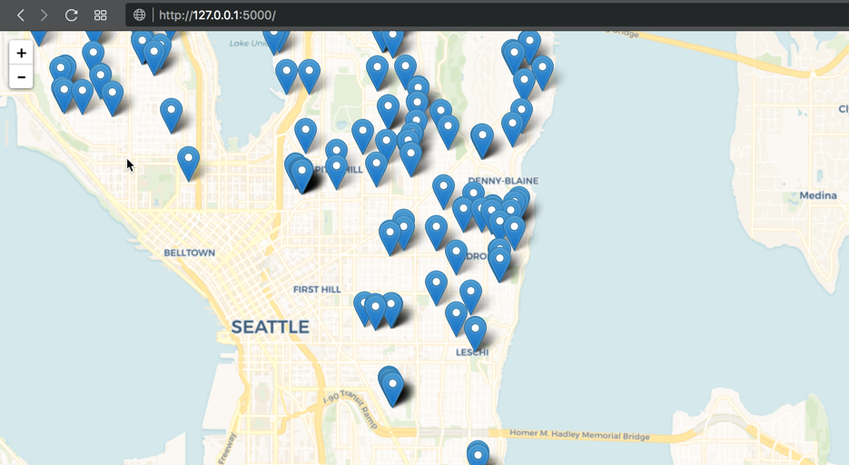
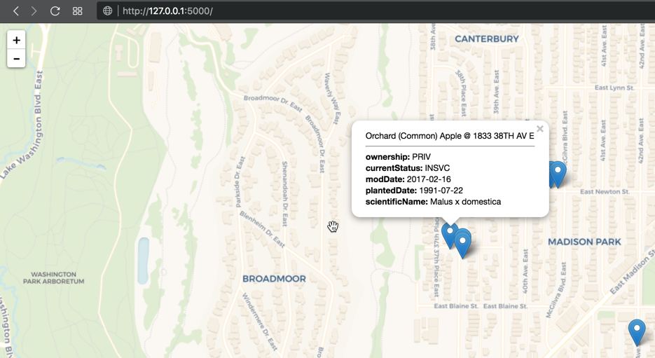

# Seattle Apple Tree Map

This app scrapes the Seattle tree map GIS database and looks for trees
which are non-crabapple, non-serviceberry apple trees.

## Running locally

This project assumes you have Python (>=2.7) and `pip` installed. To run this
project, simply check it out and run `sh init.sh`.

It should automatically open your browser to [localhost:5000](http://localhost:5000),
which within a few second should show you the ~950 orchard-tier apple trees in Seattle.  

## In Use

The tree map currently plots all apple trees in Seattle city limits. Future considerations include allowing for viewing by tree type, and lazy loading of trees based on mapbox.

### City Level View

### Neighborhood Level View 

